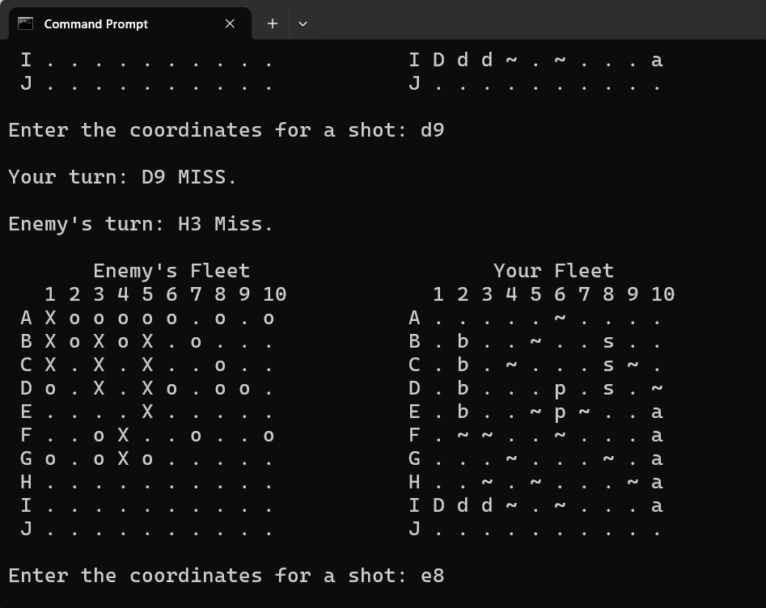
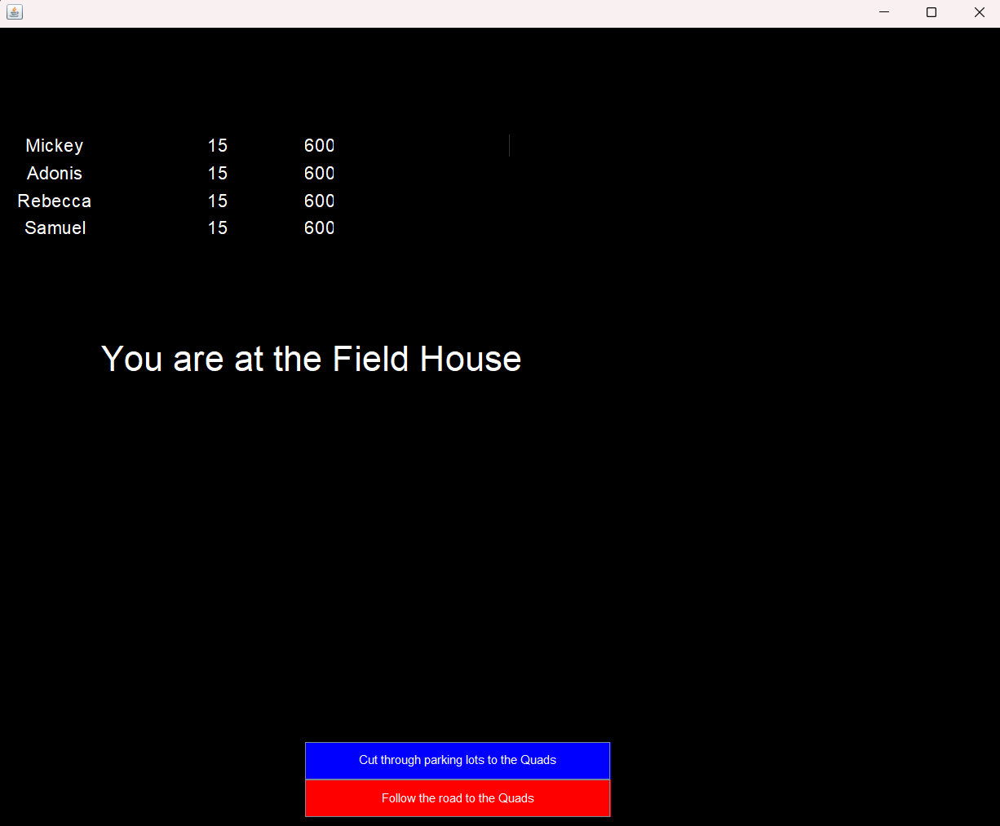
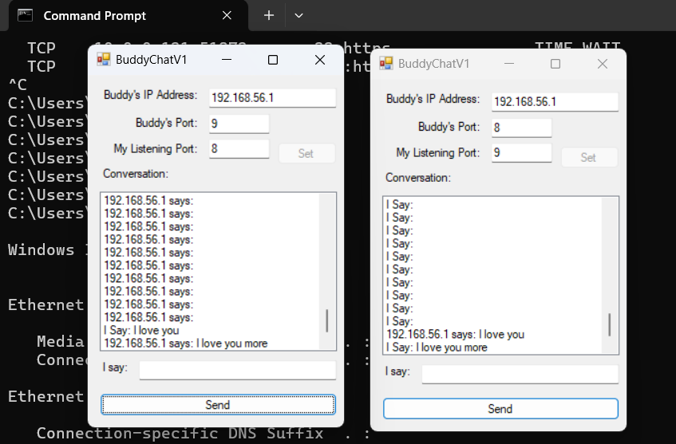
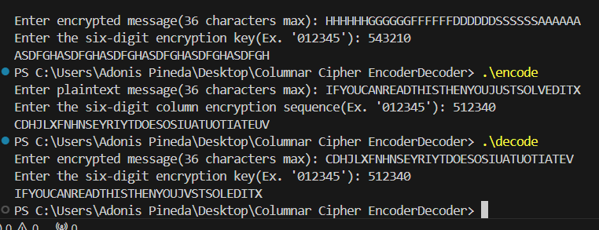

Portfolio
=========

Programming Projects
--------------------

*For access to my private project repositories, please [email me](mailto:apineda@csustudent.net?subject=GitHub%20Access) with the subject line, GitHub Access.

---
### [Battleship Game | CSCI 235](project1)

---
### [CSU Trail | CSCI 325](project2)

---
### [BuddyChat | CSCI 332](project3)

---
### [Columnar Cipher Encoder/Decoder | CSCI 452](project4)

---

Ethics Papers
-------------

### [CSCI 235 Ethics Paper](/pdf/CSCI_235.pdf)

-   **Class:** Procedural Programming  
-   **Grade:** 100

### [CSCI 325 Ethics Paper](/pdf/CSCI_325.pdf)

-   **Class:** Object Oriented Porgramming
-   **Grade:** 100

### [CSCI 332 Ethics Paper](/pdf/CSCI_332.pdf)

-   **Class:** Applied Networking
-   **Grade:** 100

---

Presentations
-------------

### [Presentation 1 Title](/pdf/sample_presentation.pdf)

- **Class:** 
- **Grade:**

### [Presentation 2 Title](/pdf/sample_presentation.pdf)

- **Class:** 
- **Grade:**

---

Page template forked from <a href="https://github.com/csu-cs/csci-portfolio">CSU-CS</a>

<!-- Remove above link if you don't want to attributive -->
