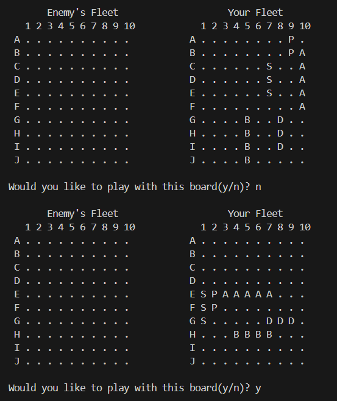
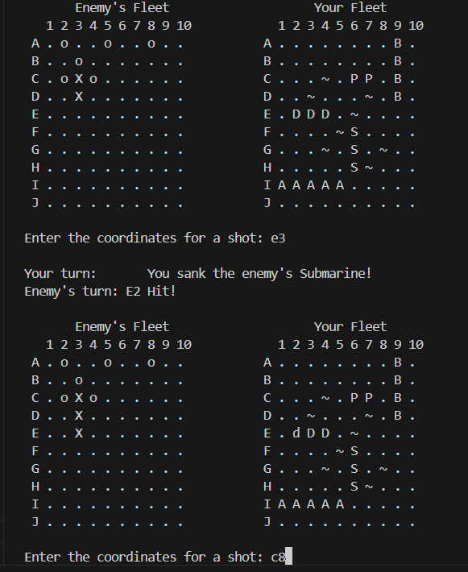
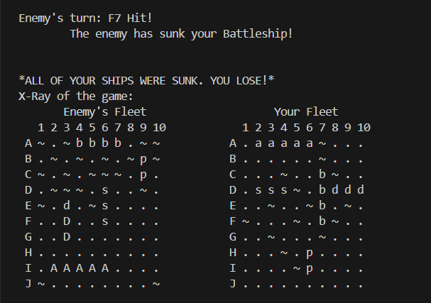
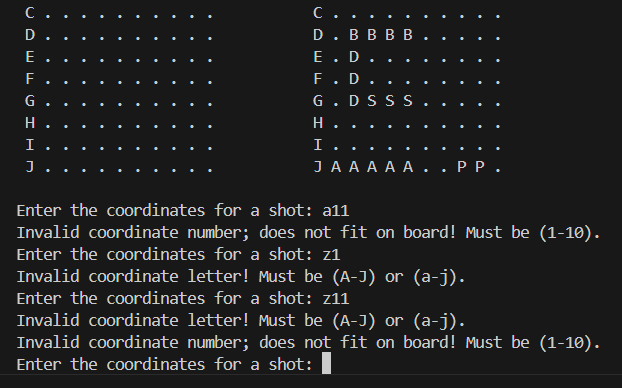

[Back to Portfolio](./)

Battleship
===============

-   **Class:** CSCI 235 Procedural Programming
-   **Grade:** 95
-   **Language(s):** C++ 
-   **Source Code Repository:** [features/mastering-markdown](https://guides.github.com/features/mastering-markdown/)  
    (Please [email me](mailto:apineda@csustudent.net?subject=GitHub%20Access) to request access.)

## Project description

This is a text-based version of the popular strategy board game, Battleship, that works in a console. The user works against an AI in order to guess the location of the enemy AI's ships and sink them before their own fleet is destroyed. There are several ships of varying sizes and unlimited random fleet arrangements to choose from. The user will utlize the grid using a letter and number combination as input for the shots. 

## How to compile and run the program

How to run the project(Windows CMD/Bash/Terminal/Console)
```
cd .\FinalProject
.\battleship
```

If the program does not run, one may need to compile:
```
cd .\FinalProject
g++ -Wextra -o battleship battleship.cpp
.\battleship
```


## UI Design

The game uses the console and input is done through text. The user will select a randomly arranged fleet until it is accepted by the user via input and the game will start. The user will enter a letter immediately followed by a number(Ex. 'A1') in order to place a "shot" and submit the input as their guess for the location of the enemy ships. The enemy AI will also also attempt to sink the player's ships. The user's successful strikes will be noted with an X while hits on the user's fleet will be reflected as lowercase versions of the respective ships. This will continue until all enemy ships are sunk or all enemy ships are sunk, triggering a win/lose event. 

The game will start with the user approving a fleet arrangement (see Fig 1), and this will be their game board. The user will enter a letter and number pair according to what is on the grid to fire on the enemy fleet, with misses represented 'O' and hits represented as 'X'(see Fig 2). If the entire user's fleet is sunk, the game will display a lose message, as well as a win message if the enemy fleet is defeated(see Fig 3). If the user enters a letter or number that exists outside the bounds of the grid(Ex. "Z11") the game will give an error message and continue to ask for proper input.

  
Fig 1. The start screen and fleet selection menu

  
Fig 2. Example of shot after coordinate entered

  
Fig 3. Image of screen when all ships are sunk

  
Fig 4. Feedback for bad/unallowed input

## 3. Additional Considerations

Sed ut perspiciatis unde omnis iste natus error sit voluptatem accusantium doloremque laudantium, totam rem aperiam, eaque ipsa quae ab illo inventore veritatis et quasi architecto beatae vitae dicta sunt explicabo. 

For more details see [GitHub Flavored Markdown](https://guides.github.com/features/mastering-markdown/).

[Back to Portfolio](./)
