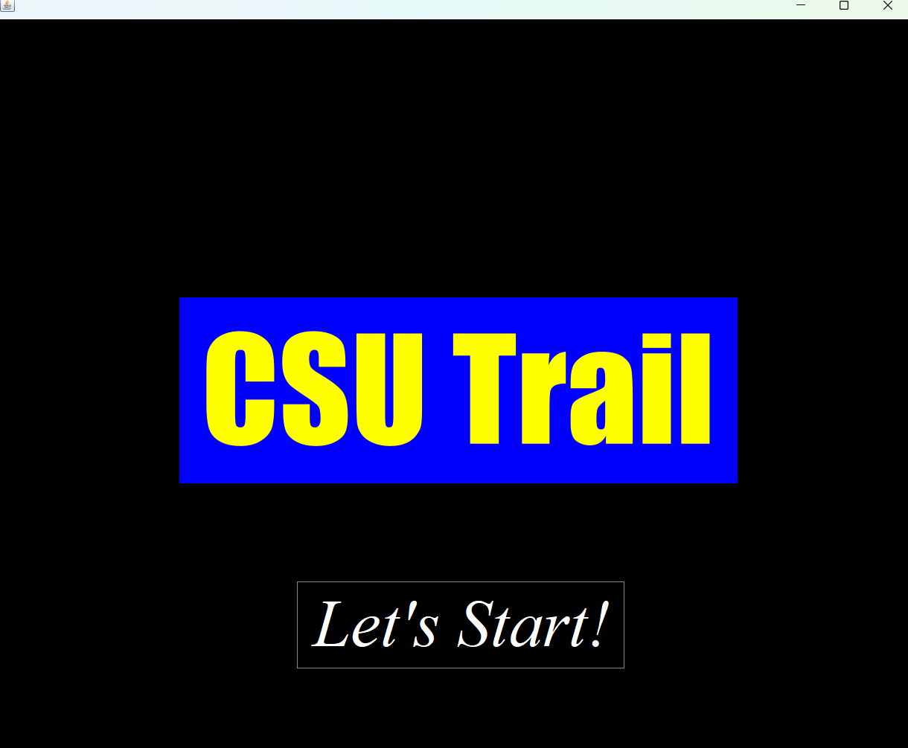
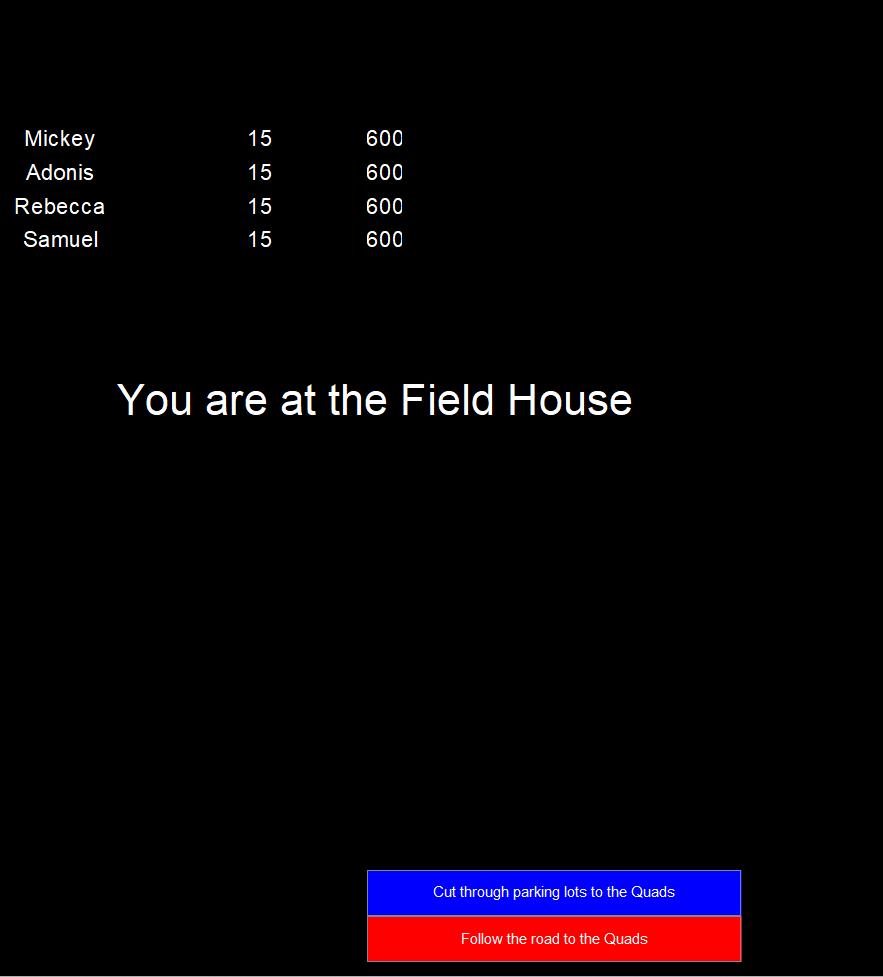
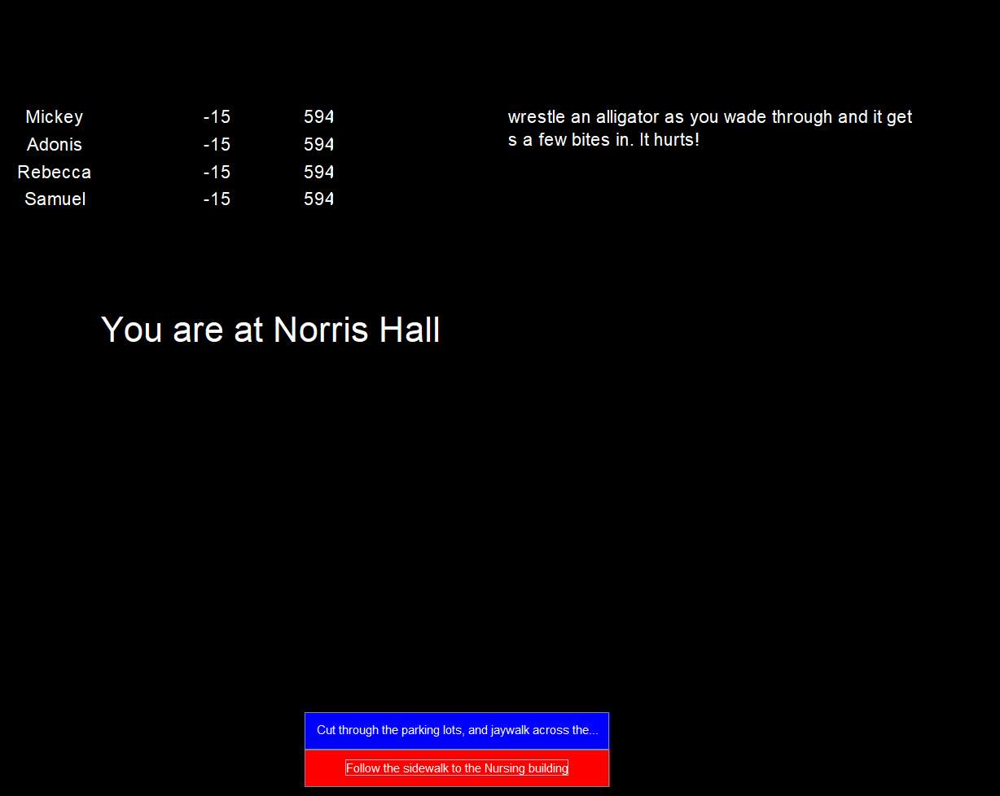
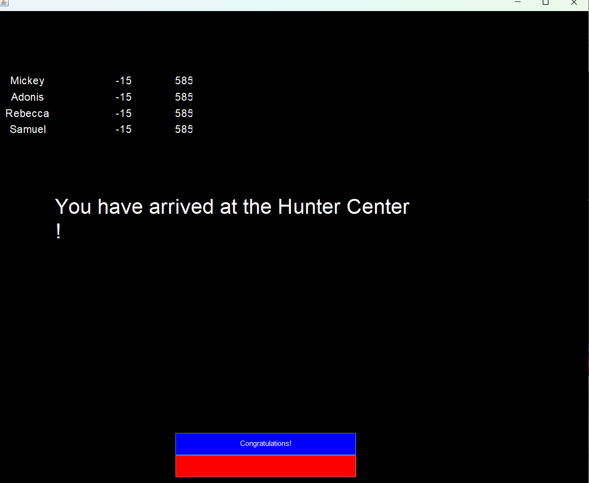

[Back to Portfolio](./)

CSU Trail
===============

-   **Class:** CSCI 325 Object Oriented Programming 
-   **Grade:** 95
-   **Language(s):** Java, JavaFX
-   **Source Code Repository:** [features/mastering-markdown](https://guides.github.com/features/mastering-markdown/)  
    (Please [email me](mailto:example@csustudent.net?subject=GitHub%20Access) to request access.)

## Project description

This is a version of the text-based retro game "The Oregon Trail" where the user will lead their team to victory by encountering problems and obstacles and be forced to make decisions favorable to the group in order to reach the final destination with at least one player "alive". It makes use of JavaFX to give the user a simple GUI for buttons as opposed to text=input and console entry. 

## How to compile and run the program

How to compile/run the project:

```
Install Java(latest LTS and include JavaFX) and Netbeans(latest versions) and open the folder in Netbeans as a project.
Click the main Java file(CSU Trail) and navigate to "Run" and click.
```

## UI Design

The game employs the use of a GUI(Graphic User Interface) to navigate the game menu and make decisions and take actions. This is achieved using JavaFX. Much like the Oregon Trail, one has a team that they should try to keep alive as they reach the destination while navigating problems and obstacles.

The user will click "Let's Start" to advance to the game at the start menu (see Fig 1). The user will then be faced with choices(see Fig 2). Some of these choices will advance the user to the end of the game, but some will damage the team's collective health(see Fig 3). If the user reaches the Hunter Center with health above 0, the user is congratulated and shown they have reaches the Hunter Center (see Fig 4).

  
Fig 1. The launch screen

  
Fig 2. Choices are presented

  
Fig 3. Some decisions will deal damage to the group

  
Fig 4. The game is won

## 3. Additional Considerations

A supported version of Java, preferrably an LTS, is needed to run this and MUST include JavaFX during installation. The package is considered the project, but one can navigate to the java file and click run on NetBeans and it will start. 

[Back to Portfolio](./)
