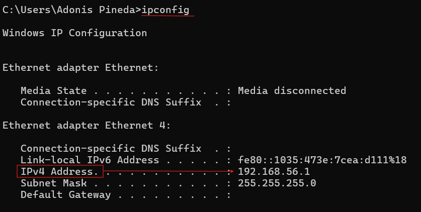
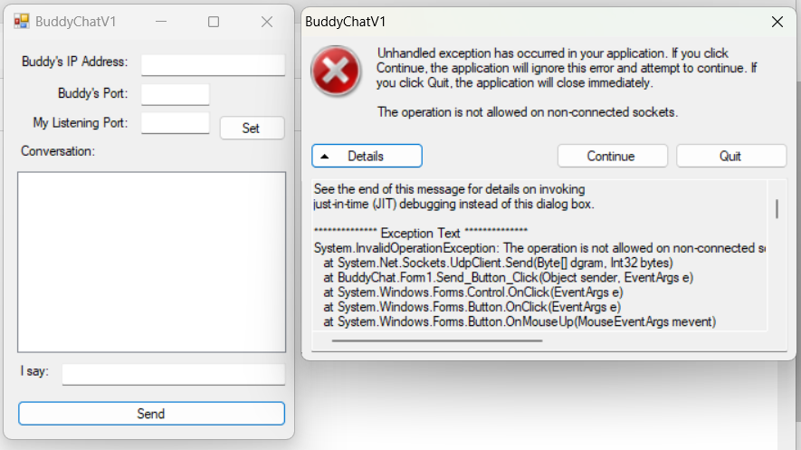

[Back to Portfolio](./)

BuddyChat
===============

-   **Class:** CSCI 332 Applied Networking
-   **Grade:** 90
-   **Language(s):** Microsoft Visual Basic 
-   **Source Code Repository:** [features/mastering-markdown](https://guides.github.com/features/mastering-markdown/)  
    (Please [email me](mailto:example@csustudent.net?subject=GitHub%20Access) to request access.)

## Project description

This is a messaging system that uses a basic GUI and allows two seperate users with BuddyChat to send each other messages using UDP. The users set an IP and a listening port in order to dial in the "frequency" or "mailbox" and can then establish communication. The program can log a conversation and denote the IP of the user sending the messages. 

## How to compile and run the program

How to compile or run the project.

```
Using Microsoft Visual Basic, install the folder containing the files to machine and open as a project
Click "Build" and "Build Solution"
Name and run the compiled executable 
```

## UI Design

BuddyChat uses UDP to establish communication between two seperate machines on the same network, whether wireless or Ethernet. This is achieved by setting the IP Address of the intended recipient. 

First, the recipient will give their Ethernet IP Address to the sender and set a listening port. This can be achieved by connecting to the same router or belonging to the same workgroup cluster, and using the native terminal to determine IP configurations, such as "ipconfig" command in Command Prompt (see Fig 1). The user will set the IP Address to the intended recipient and set the listening port to the "buddy"(other BuddyChat client on seperate machine) listening port and vice versa (see Fig 2). If the program is used without IP Address or listening port settings, an error dialogue will appear (see Fig 3).

  
Fig 1. use of ipconfig and correct settings index to use for client

  
Fig 2. example of client configuration and successful conversation

  
Fig 3. error message 

## Additional Considerations

Both clients of BuddyChat must be connected to the same network, whether Ethernet or wireless. They can even exist on two seperate machines, whether physical or virtual. It is important to avoid using a listening port that is used by default to avoid collisions.  

[Back to Portfolio](./)
